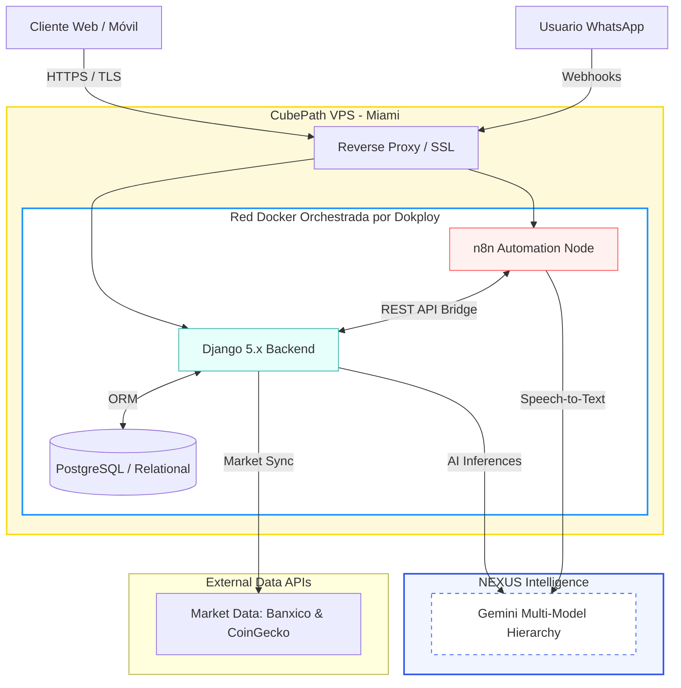

# BIOR Invest AI 🚀
**Tracker de Inversiones y Análisis de Portafolio impulsado por IA.**
 


> **📌 Nota de Visualización:** Debido a las políticas de seguridad de la API de Twilio, el asesor de WhatsApp se encuentra en **modo privado**. Puedes consultar las capturas de ejecución y el flujo del grafo en la sección de [Evidencia Técnica](#-evidencia-de-ejecución-logs--interfaz).

---

## 📑 Abstract e Introducción

**BIOR Invest AI** es una plataforma integral de gestión patrimonial diseñada específicamente para el entorno macroeconómico y fiscal mexicano. El sistema está desarrollado para democratizar el acceso a la educación financiera, permitiendo a los usuarios que mantienen capital estático o en instrumentos de bajo riesgo (como CETES o Efectivo) dar el salto hacia la construcción de un portafolio diversificado.

El diferenciador técnico del proyecto y su función estrella es un **Agente de IA integrado**, accesible tanto por interfaz web como por canales conversacionales asíncronos (WhatsApp). Este agente monitorea la distribución real de los activos del usuario y ejecuta análisis cuantitativos para sugerir optimizaciones en tiempo real. 

Para garantizar un estándar institucional en las recomendaciones, el motor analítico está fundamentado empíricamente en las estrategias de diversificación de **[Long Angle](https://www.longangle.com/)** (comunidad global de inversionistas de alto patrimonio). La plataforma adapta y parametriza estos principios para que cualquier usuario minorista pueda construir un portafolio resiliente.

El despliegue se orquesta en su totalidad sobre Ubuntu 24.04 utilizando Dokploy dentro de la infraestructura de alto rendimiento de **CubePath**.

> ### 🔗 Enlaces y Recursos del Proyecto
> 
> * **🚀 Demo en Vivo:** [invest-ai.bior-studio.com](https://invest-ai.bior-studio.com)
> * **📂 Código Fuente:** [GitHub Repository](https://github.com/AlanBIOR/bior-invest-ai)
>
---


## 1. 💡 ¿Qué problema resolvemos?

En México, proteger tu dinero de la inflación y entender cómo funcionan los impuestos (como el ISR o los beneficios de las SOFIPOS) suele ser un dolor de cabeza. Por eso, mucha gente deja su dinero estático o se queda solo con herramientas básicas, perdiendo la oportunidad de diversificar.

**BIOR Invest AI** llega para romper esa barrera. Nos basamos en las estrategias de diversificación que usan los expertos en finanzas (basadas en la comunidad *Long Angle*) y las "traducimos" para que cualquier persona pueda aplicarlas a su propio bolsillo.

Más que ser una simple libreta digital para anotar qué compraste, el sistema actúa como un proyector de tu futuro financiero. Para lograrlo, el motor de la plataforma calcula el interés compuesto real de tu portafolio usando este modelo:

$$VF = \sum_{i=1}^{n} \left[ VP_i(1 + r_i)^t + A_i \frac{(1 + r_i)^t - 1}{r_i} \right]$$

*¿Qué significa esta ecuación en la práctica? Básicamente, calculamos tu Valor Futuro ($VF$) tomando tu capital inicial ($VP$), y le sumamos el impacto multiplicador de tus aportaciones mensuales ($A$) junto con el rendimiento específico que te da cada activo ($r$) a lo largo del tiempo ($t$).*

<div align="center">
  <p>
    
    
  </p>

  <p>
    <b>Fig. 1:</b> El dashboard calculando en tiempo real las proyecciones de crecimiento con base en los activos del usuario.
  </p>
</div>

## 2. 🏗️ Arquitectura de Infraestructura

Se desplego toda la infraestructura en la nube de **CubePath**, ubicando nuestro servidor en Miami, FL, para asegurar la latencia más baja posible al conectarnos con las APIs de OpenAI, CoinGecko y Banxico.

Correr todo el ecosistema (Web + IA + Automatización) de manera fluida en una instancia **gp.nano** de CubePath.

**¿Cómo estructuramos el servidor (1 vCPU, 2 GB RAM, 40 GB Storage)?**

1. **Orquestación y Seguridad Automatizada (Dokploy + Docker):** Utilizamos Dokploy como nuestro panel de control para gestionar los contenedores Docker. Dokploy se encargó de la magia del enrutamiento interno, conectando nuestro dominio personalizado (`invest-ai.bior-studio.com`) y emitiendo automáticamente los certificados SSL para garantizar que todo el tráfico viaje encriptado.

2. **Base de Datos Ligera y Eficiente (SQLite):**
   Para proteger la memoria RAM del servidor (2 GB) y evitar cuellos de botella, tomamos la decisión técnica de omitir motores pesados como PostgreSQL o MySQL. En su lugar, utilizamos **SQLite** integrado de forma nativa en Django. Al ser una base de datos basada en archivos, nos da lecturas y escrituras rapidísimas con un consumo de recursos casi nulo, ideal para la gestión de perfiles de esta etapa.

3. **Motor de Automatización Aislado (n8n):**
   Para darle vida a nuestro asistente de WhatsApp, desplegamos un contenedor de **n8n** operando en paralelo con Django. Este contenedor funciona como el "puente de comunicaciones": recibe las notas de voz o texto de los usuarios por WhatsApp, las procesa, consulta a la IA y devuelve las estrategias financieras, todo centralizado bajo nuestro mismo dominio.

<div align="center" style="background-color: #f8fafc; padding: 30px; border-radius: 20px; border: 1px solid #e2e8f0; margin: 20px 0;">

### 🌐 Diagrama de Topología de Red (Capa L7)



<p style="color: #64748b; font-size: 0.9rem; font-style: italic; margin-top: 15px;">
<b>Fig. 2:</b> Diagrama arquitectónico detallando el flujo de datos entre el usuario final, la infraestructura en CubePath y los microservicios acoplados.
</p>
</div>

---

## 3. ⚙️ Backend y Frontend

### 3.1. Núcleo Monolítico (Django & Python)
El backend actúa como la única fuente de verdad (SSOT), manejando la lógica de negocio y la capa de seguridad.
- **Data Fetching Híbrido:** Integración de módulos `services.py` para consumir la API de Banco de México y obtener tasas reales de CETES, asegurando proyecciones con datos fidedignos del mercado.
- **Enrutamiento Dinámico:** Patrón de diseño MVC utilizando resolutores de *slugs* para inyectar dinámicamente contextos de renderizado sin duplicación de código.

### 3.2. Arquitectura Frontend Modular (Vanilla JS)
Se adoptó un enfoque *Zero-Framework* para el core de la interfaz, estructurando el código en módulos ES6 orquestados por un `main.js` limpio mediante el patrón *Facade*.
- **Mecanismos de Sincronización:** Uso de `debouncing` en la captura de *inputs* para mitigar la sobrecarga de solicitudes `POST /guardar-progreso/` al servidor, protegiendo el I/O de la base de datos.
- **Buscador Asíncrono de Activos:** Motor híbrido que cruza diccionarios de memoria local (activos fiat) con llamadas HTTP en tiempo real a CoinGecko para indexación de criptoactivos, disparando eventos del DOM (`dispatchEvent`) de manera programática.


*Fig. 3: Módulo de búsqueda reactiva integrando fuentes locales y externas.*

---

## 4. 🧠 Tu asesor de inversiones en la Web y en WhatsApp

La gran diferencia de este proyecto es que no necesitas estar pegado a la computadora para recibir consejos. Logramos que la Inteligencia Artificial salga del navegador y llegue directamente a tu celular.

### 4.1. El Asistente Inteligente del Dashboard (Python + IA)
Dentro de la página pusimos un chat que no es un bot cualquiera. Este asistente tiene permiso para "leer" cómo tienes repartido tu dinero en tu portafolio de Django. 
- **¿Qué hace?** Compara lo que tú tienes invertido contra el modelo ideal de *Long Angle*.
- **¿Cuál es el resultado?** Te escribe una lista de consejos personalizados para que sepas exactamente qué activos te faltan comprar para correr menos riesgos y ganar más.

### 4.2. El Puente Inteligente: NEXUS via WhatsApp (Omni-Channel)

Para lograr una fricción cero, integramos **NEXUS Core** con WhatsApp mediante una orquestación avanzada en **n8n**, hosteado en nuestra infraestructura privada de **CubePath**. Este motor híbrido procesa lenguaje natural en tiempo real, ya sea mediante **texto directo** o **notas de voz**.

<div align="center" style="margin: 30px 0;">
  <table style="border-collapse: collapse; border: 1px solid #30363d; border-radius: 12px; width: 100%; overflow: hidden;">
    <thead>
      <tr style="border-bottom: 1px solid #30363d;">
        <th style="padding: 15px; color: #58a6ff; font-size: 1.1rem;">
          ⚙️ Arquitectura del Flujo Multimodal (NEXUS Engine)
        </th>
      </tr>
    </thead>
    <tbody>
      <tr>
        <td style="padding: 25px; text-align: left; line-height: 1.6;">
          <p>
            <b>1. Ingesta Inteligente:</b> Captura de eventos vía Webhook seguro. Un nodo <code>Switch</code> discrimina instantáneamente entre <i>Plain Text</i> y archivos binarios <code>.ogg</code>.
          </p>
          <p>
            <b>2. Speech-to-Text (Whisper):</b> Descarga asíncrona desde Twilio y procesamiento mediante el servidor de <b>Whisper AI</b> para una transcripción financiera de alta fidelidad.
          </p>
          <p>
            <b>3. Normalización de Datos:</b> Unificación de flujos en un objeto JSON estandarizado, eliminando ruido y preparando el <i>prompt context</i>.
          </p>
          <p>
            <b>4. Contexto Dinámico (Django Bridge):</b> Petición <code>POST</code> autenticada hacia el backend de <b>Django</b> para realizar un cruce de datos con activos reales y perfil de riesgo.
          </p>
          <p>
            <b>5. Cierre del Bucle:</b> Generación de respuesta estratégica vía <b>Gemini 1.5 Flash</b> y entrega al chat del usuario en &lt; 2 segundos.
          </p>
        </td>
      </tr>
    </tbody>
  </table>
</div>

#### 📸 Evidencia de Ejecución (Logs & Interfaz)

Debido a las políticas de seguridad de la API de **Twilio (Sandbox Mode)**, el acceso está restringido al número del desarrollador para pruebas de integridad.

<table align="center" style="border-collapse: collapse; border: none;">
  <tr style="border: none;">
    <td align="center" style="border: none; padding: 10px; vertical-align: bottom;">
      
      <br>
      <p style="color: #64748b; font-size: 0.85rem; font-style: italic; margin-top: 10px;">
        <b>Fig. 4:</b> Grafo de ejecución en n8n mostrando la bifurcación lógica y el éxito del proceso.
      </p>
    </td>
    <td align="center" style="border: none; padding: 10px; vertical-align: bottom;">
      
      <br>
      <p style="color: #64748b; font-size: 0.85rem; font-style: italic; margin-top: 10px;">
        <b>Fig. 5:</b> Interfaz de WhatsApp recibiendo asesoría patrimonial de NEXUS en tiempo real.
      </p>
    </td>
  </tr>
</table>

> **🔒 Nota de Seguridad:** La comunicación entre n8n y Django está protegida mediante una **X-Api-Key** de alta entropía, asegurando que la información financiera nunca viaje de forma expuesta.

## 5. 🎨 Experiencia del Usuario

El diseño de la interfaz prioriza la carga cognitiva reducida y la legibilidad de datos financieros complejos.
- **Visualización de Datos:** Integración de `Chart.js` para renderizar gráficas de dona reactivas que reflejan instantáneamente los rebalanceos del portafolio.
- **Retroalimentación Visual:** Sistema de notificaciones no intrusivas implementado con `SweetAlert2` y validación de estado asíncrono para operaciones CRUD de activos.
- **Diseño Responsivo:** Tablas de datos con paginación algorítmica calculada en el cliente y adaptación *mobile-first*.


<p style="color: #64748b; font-size: 0.85rem; font-style: italic; margin-top: 10px;">
   <b>Fig. 6:</b> Componente de visualización estratégica reflejando la distribución de activos.
</p>

---

## 6. 📦 Guía de Despliegue (Reproducibilidad)

El proyecto está diseñado para ser desplegado de manera nativa y ligera en infraestructura Linux, operando exitosamente incluso en instancias con recursos limitados (1 vCPU, 2GB RAM en Ubuntu 24.04).

### Prerrequisitos
- Servidor Linux VPS (Recomendado: [CubePath](https://cubepath.com/))
- Python 3.10+ y `pip` instalados.
- Entorno virtual (`venv`) configurado.

### Pasos de Instalación Nativa

1. Clonar el repositorio:
   ```bash
   git clone https://github.com/AlanBIOR/bior-invest-ai.git
   cd bior-invest-ai
   ```
   
2. Crear y activar el entorno virtual, e instalar dependencias:
   ```bash
   python3 -m venv venv
   source venv/bin/activate
   pip install -r requirements.txt
   ```

3. Configurar variables de entorno
   ```env
   SECRET_KEY=tu_django_secret
   DEBUG=False
   BANXICO_TOKEN=tu_token_banxico
   GEMINI_API_KEY=tu_token_gemini
   ```

4. Ejecutar migraciones y recolectar archivos estáticos:
   ```bash
   python manage.py migrate
   python manage.py collectstatic --noinput
   ```

5. Levantar el servicio en producción (Usando Gunicorn):
   ```bash
   gunicorn core.wsgi:application --bind 0.0.0.0:8000 --workers 3   
   ```

---

✨ **Un proyecto de [Alan Alfonso Rodríguez Ibarra](https://github.com/AlanBIOR)**

Desarrollar **BIOR Invest AI** para la **CubePath Hackathon 2026** fue una experiencia brutal. Me encantó el reto de exprimir al máximo un VPS para crear una herramienta que realmente ayude a las personas a mejorar sus finanzas y entender el poder de su dinero. ¡Gracias por ser parte de este camino y por revisar mi trabajo! 

### 📧 Email de contacto 
* ✉️ **Email:** [bior2610@gmail.com](mailto:bior2610@gmail.com)
* ✉️ **Email Personal:** [alanalfonso261002@gmail.com](mailto:alanalfonso261002@gmail.com)

### ✅ Confirmación de Participación

- [x] Mi proyecto está desplegado en CubePath y funciona correctamente.
- [x] El repositorio es público y contiene un README con la documentación.
- [x] He leído y acepto las [reglas de la hackatón](https://github.com/midudev/hackaton-cubepath-2026).