# BIOR Invest AI 🚀

<div align="center">
  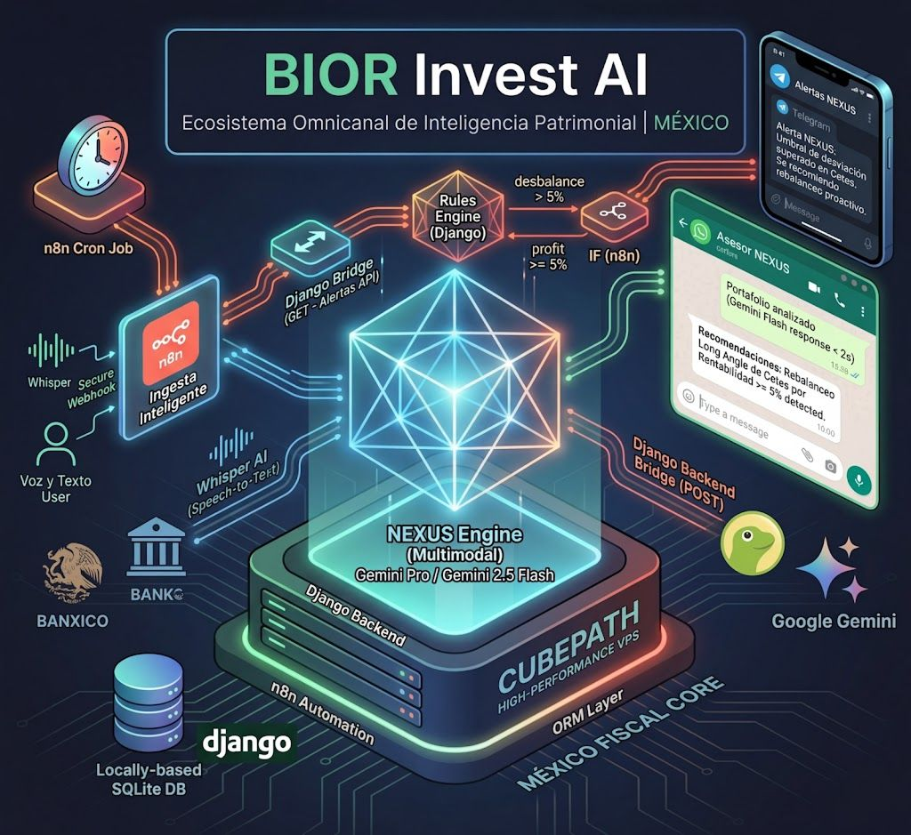
</div>

**Tracker de Inversiones y Análisis de Portafolio impulsado por IA.**
 


> **📌 Notas de Acceso y Evaluación:**
> - **🖥️ Registro Web:** Para probar el dashboard interactivo, crear tu portafolio y acceder al **Action Hub**, es necesario registrarse. Puedes utilizar **cualquier número de teléfono ficticio** (el sistema no exige verificación por SMS).
> - **💬 Asesor de WhatsApp:** Debido a las restricciones del Sandbox de Twilio, el bot de WhatsApp está en modo privado. Puedes validar su funcionamiento en la [Evidencia Técnica](#-evidencia-de-ejecución-logs--interfaz).
> - **📱 Notificaciones de Telegram:** NEXUS ahora es proactivo. Al vincular tu **Telegram ID** en el perfil, el sistema te enviará alertas automáticas de rebalanceo y rendimiento basadas en los datos reales de tu base de datos.

---

## 📑 Abstract e Introducción

**BIOR Invest AI** es una plataforma integral de gestión patrimonial diseñada específicamente para el entorno macroeconómico y fiscal mexicano. El sistema permite a los usuarios que mantienen capital estático o en instrumentos de bajo riesgo (como CETES o Efectivo) dar el salto hacia la construcción de un portafolio diversificado de nivel institucional.

El diferenciador técnico y la función estrella del proyecto es el **NEXUS Engine**, un ecosistema de IA omnicanal accesible vía Web, WhatsApp y **Telegram**. Este motor monitorea en tiempo real la distribución de activos en la base de datos de Django y ejecuta análisis cuantitativos. A diferencia de otros bots, NEXUS es **proactivo**: utiliza un sistema de alertas por umbral para notificar automáticamente al usuario sobre desbalances o hitos de rendimiento directamente en su celular.

Para garantizar un estándar de alta fidelidad en las recomendaciones, el motor analítico está fundamentado en las estrategias de diversificación de **[Long Angle](https://www.longangle.com/)**. La plataforma parametriza estos principios para que cualquier usuario minorista pueda construir un portafolio resiliente y optimizado.

El despliegue se orquesta en su totalidad sobre Ubuntu 24.04 utilizando **Dokploy** dentro de la infraestructura de alto rendimiento de **CubePath**.

> ### 🔗 Enlaces y Recursos del Proyecto
> 
> * **🚀 Demo en Vivo:** [invest-ai.bior-studio.com](https://invest-ai.bior-studio.com)
> * **📂 Código Fuente:** [GitHub Repository](https://github.com/AlanBIOR/bior-invest-ai)
> * **🤖 Bot de Telegram:** [@BiorNexusBot](https://t.me/BiorNexusBot) (Sujeto a vinculación de ID en perfil)

---


## 1. 💡 ¿Qué problema resolvemos?

En México, proteger el dinero de la inflación y navegar la complejidad fiscal suele ser una barrera para el inversionista promedio. Esta falta de claridad provoca que el capital se mantenga estático o subutilizado, perdiendo el impacto multiplicador del mercado.

**BIOR Invest AI** rompe esta inercia. Traducimos las estrategias de diversificación de nivel institucional (basadas en la comunidad **Long Angle**) para que cualquier persona pueda aplicarlas a su patrimonio personal.

### El Motor de Proyección y Vigilancia
Más que una bitácora digital, el sistema actúa como un proyector financiero dinámico. El motor de la plataforma calcula el interés compuesto real y el valor futuro ($VF$) de cada activo integrando variables de aportación y rendimiento:

$$VF = \sum_{i=1}^{n} \left[ VP_i(1 + r_i)^t + A_i \frac{(1 + r_i)^t - 1}{r_i} \right]$$

*¿Qué significa esta ecuación en la práctica? Calculamos tu proyección de riqueza tomando tu capital inicial ($VP$), sumando el impacto de tus aportaciones mensuales ($A$) y el rendimiento específico de cada clase de activo ($r$) a través del tiempo ($t$).*

A este modelo matemático le hemos añadido una **Capa de Vigilancia Activa**. El sistema no solo proyecta; si los datos reales de tu portafolio se desvían de los umbrales de seguridad (ej. exceso de volatilidad o falta de liquidez), NEXUS interviene automáticamente notificándote por canales omnicanal.

<div align="center">
  <p>
    
    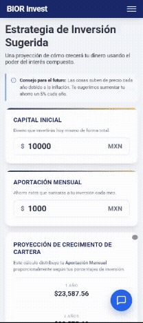
  </p>
  
  <p style="color: #64748b; font-size: 0.85rem; font-style: italic; margin-top: 10px;">
    <b>Fig. 1:</b> Dashboard calculando en tiempo real proyecciones de crecimiento y estados de rebalanceo.
  </p>
</div>

## 2. 🏗️ Arquitectura de Infraestructura

Elegimos la nube de **CubePath** para alojar todo el proyecto, ubicando nuestro servidor en Miami, FL. Esta ubicación nos garantiza una conexión rapidísima y sin interrupciones tanto con los motores de Inteligencia Artificial como con las fuentes de datos financieros.

Nuestro gran objetivo al usar CubePath fue demostrar la eficiencia de nuestra plataforma: logramos que un ecosistema robusto y completo (Plataforma Web + IA + Automatizaciones + Alertas a celular) corra de manera perfectamente fluida en una de sus instancias más básicas y accesibles, la **gp.nano** (1 vCPU, 2 GB RAM).

### Estrategia de Optimización de Recursos:

1. **Orquestación con Dokploy:** Utilizamos Dokploy para gestionar contenedores aislados. Esto permitió segmentar el tráfico mediante un **Reverse Proxy** con SSL automatizado, asegurando que cada servicio (Django y n8n) consuma únicamente los recursos necesarios sin interferir entre sí.

2. **Persistencia Eficiente con SQLite:**
   Para proteger la memoria RAM, sustituimos motores pesados por **SQLite**. Al ser una base de datos basada en archivos, elimina el consumo constante de procesos en segundo plano de un servidor SQL tradicional, ofreciendo una latencia de lectura/escritura casi nula para el volumen de datos de la plataforma.

3. **Cerebro Omnicanal (n8n):**
   Desplegamos un nodo de **n8n** que actúa como el "Communications Hub". Este contenedor no solo procesa mensajes entrantes (WhatsApp/Telegram), sino que ejecuta un **Cron Job** que consulta periódicamente la base de datos de Django para disparar las notificaciones proactivas de rebalanceo.

<div align="center" style="background-color: #f8fafc; padding: 30px; border-radius: 20px; border: 1px solid #e2e8f0; margin: 20px 0;">

### 🌐 Diagrama de Topología de Red (Capa L7)

```mermaid
graph TD
    %% 1. ENTRADA (TOP)
    Client[Cliente Web / Móvil]
    WA[WhatsApp User]
    TG[Telegram User]

    %% 2. INFRAESTRUCTURA (MIDDLE)
    subgraph CubePath_Cloud_VPS [CubePath VPS - Miami]
        Proxy{Reverse Proxy / SSL}
        
        subgraph Docker_Engine [Entorno Dockerizado - Dokploy]
            Django[Django 5.x Backend]
            N8N[n8n Automation Node]
            DB[(SQLite - Local Storage)]
        end
    end

    %% 3. SERVICIOS EXTERNOS (BOTTOM)
    subgraph AI_Core [NEXUS Intelligence]
        Gemini_Cluster[Gemini 2.5 Flash / Pro]
    end

    subgraph External_Services [APIs & Messaging]
        Fin_APIs[Banxico & CoinGecko]
        Twilio[Twilio API - WhatsApp]
        TelegramAPI[Telegram Bot API]
    end

    %% --- FLUJOS ---
    
    %% Tráfico de entrada
    Client -->|HTTPS| Proxy
    WA -->|Webhook| Proxy
    TG -->|Webhook| Proxy

    %% Distribución Interna
    Proxy --> Django
    Proxy --> N8N

    %% Comunicación Inter-App
    N8N <-->|REST API Bridge| Django
    Django <-->|ORM| DB

    %% Salida a servicios
    Django --->|AI Inferences| Gemini_Cluster
    Django --->|Market Sync| Fin_APIs
    N8N --->|Speech-to-Text| Gemini_Cluster
    N8N --->|Send Message| Twilio
    N8N --->|Proactive Alerts| TelegramAPI

    %% Estilos (GitHub Optimized)
    style CubePath_Cloud_VPS fill:#fff9db,stroke:#fadb14,stroke-width:2px,color:#000
    style Docker_Engine fill:#ffffff,stroke:#1890ff,stroke-width:2px,color:#000
    style AI_Core fill:#f0f5ff,stroke:#2f54eb,stroke-width:2px,color:#000
    style Django fill:#e6fffa,stroke:#38b2ac,color:#000
    style N8N fill:#fff1f0,stroke:#ff4d4f,color:#000
    style DB fill:#f5f5f5,stroke:#595959,color:#000
    style Gemini_Cluster fill:#fff,stroke:#2f54eb,stroke-dasharray: 5 5,color:#000
  ```

  <p style="color: #64748b; font-size: 0.9rem; font-style: italic; margin-top: 15px;">
  <b>Fig. 2:</b> Topología del ecosistema omnicanal operando eficientemente desde una única instancia VPS en CubePath.
</p>
</div>

## 3. ⚙️ Backend y Frontend

### 3.1. Núcleo Monolítico (Django & Python)
El backend actúa como la única fuente de verdad, manejando la lógica de negocio y la capa de seguridad.
- **Data Fetching Híbrido:** Integración de módulos `services.py` para consumir la API de Banco de México y obtener tasas reales de CETES, asegurando proyecciones con datos fidedignos del mercado.
- **Enrutamiento Dinámico:** Patrón de diseño MVC utilizando resolutores de *slugs* para inyectar dinámicamente contextos de renderizado sin duplicación de código.
- **Backoffice y ORM Seguro:** Implementación del panel de administración nativo de Django acoplado a SQLite, permitiendo la gestión robusta del catálogo de activos, transacciones y perfiles de riesgo con control de acceso basado en roles.
- **APIs & Webhooks Híbridos:** Creación de endpoints seguros (`@csrf_exempt`) protegidos por validación de `X-Api-Key` y tokens de entorno. Estos endpoints orquestan la comunicación bidireccional con n8n, manejando tanto la ingesta de consultas omnicanal (WhatsApp/Telegram) como el despacho de *cron jobs* para las notificaciones proactivas.

<div align="center">
  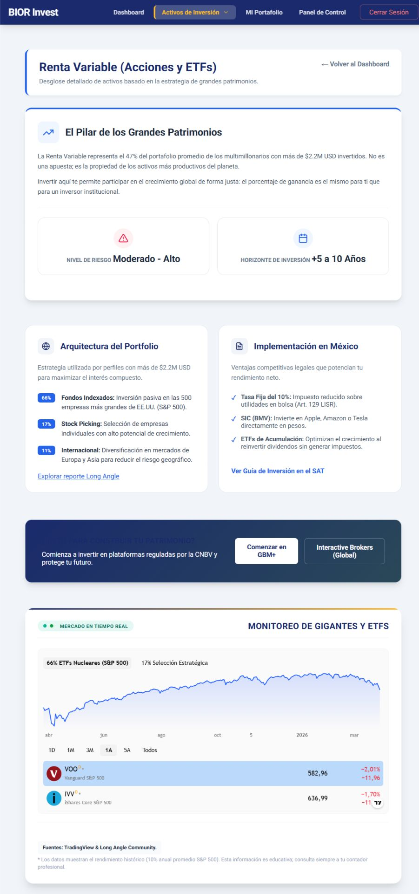
  
  <p style="color: #64748b; font-size: 0.85rem; font-style: italic; margin-top: 10px;">
    <b>Fig. 3:</b> Vista de Renta Fija mostrando tasas de CETES actualizadas mediante la integración con la API de Banxico.
  </p>
</div>

<div align="center">
  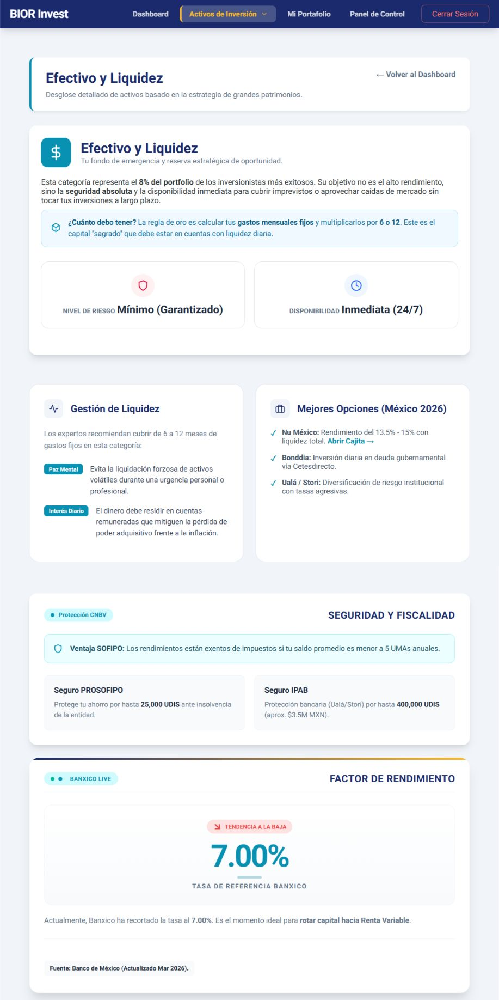
  
  <p style="color: #64748b; font-size: 0.85rem; font-style: italic; margin-top: 10px;">
    <b>Fig. 4:</b> Vista de Efectivo facilitando el tracking de liquidez inmediata y cuentas a la vista (como SOFIPOS) sin fricción.
  </p>
</div>

<div align="center">
  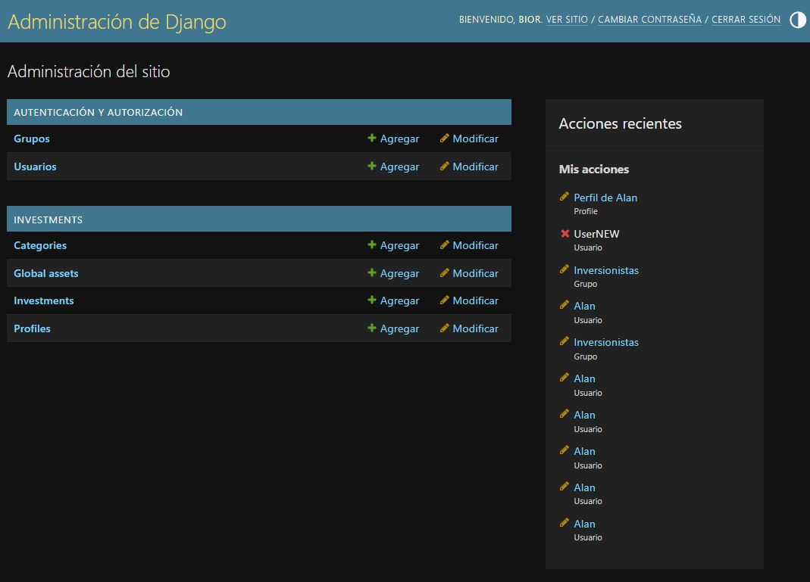
  
  <p style="color: #64748b; font-size: 0.85rem; font-style: italic; margin-top: 10px;">
    <b>Fig. 5:</b> Backoffice del sistema mapeando directamente los modelos relacionales del portafolio de inversiones.
  </p>
</div>

### 3.2. Arquitectura Frontend Modular (Vanilla JS)
Se adoptó un enfoque *Zero-Framework* para el core de la interfaz, estructurando el código en módulos ES6 orquestados por un `main.js` limpio mediante el patrón *Facade*.
- **Mecanismos de Sincronización:** Uso de `debouncing` en la captura de *inputs* para mitigar la sobrecarga de solicitudes `POST /guardar-progreso/` al servidor, protegiendo el I/O de la base de datos.
- **Buscador Asíncrono de Activos:** Motor híbrido que cruza diccionarios de memoria local (activos fiat) con llamadas HTTP en tiempo real a CoinGecko para indexación de criptoactivos, disparando eventos del DOM (`dispatchEvent`) de manera programática.

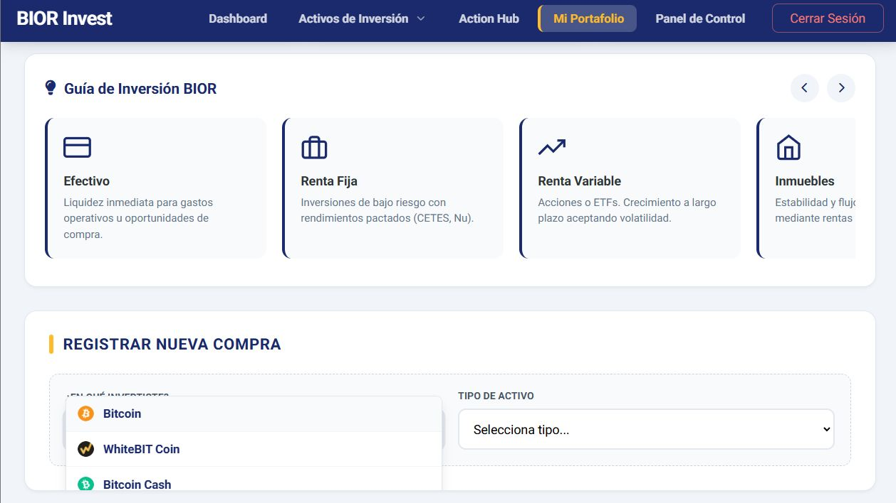
<div align="center">
   <p style="color: #64748b; font-size: 0.85rem; font-style: italic; margin-top: 10px;">
      <b>Fig. 6:</b> Módulo de búsqueda reactiva integrando fuentes locales y externas.
   </p>
</div>

---

## 4. 🧠 Tu asesor de inversiones: Web, WhatsApp y Telegram

La gran diferencia de este proyecto es que no necesitas estar pegado a la computadora para recibir consejos. Logramos que la Inteligencia Artificial opere en tres niveles distintos: generando reportes completos, chateando en vivo y enviando alertas proactivas a tu celular.

### 4.1. NEXUS Advisor: Action Hub
El **[Action Hub](https://invest-ai.bior-studio.com/nexus-advisor/)** transforma la inteligencia financiera en un plan de acción ejecutable. 

El usuario ingresa su capital y aportaciones, y el sistema "lee" su base de datos para generar un reporte que incluye:
- **Diagnóstico de Riesgo:** Cuantifica riesgos específicos.
- **Misión de Hoy y Guía de Ruta:** Pasos numerados para ejecutar la estrategia *Long Angle* de inmediato.
- **Optimización Fiscal y Simulador:** Gráficas de interés compuesto y consejos para minimizar impuestos.

<div align="center" style="margin-top: 20px;">
  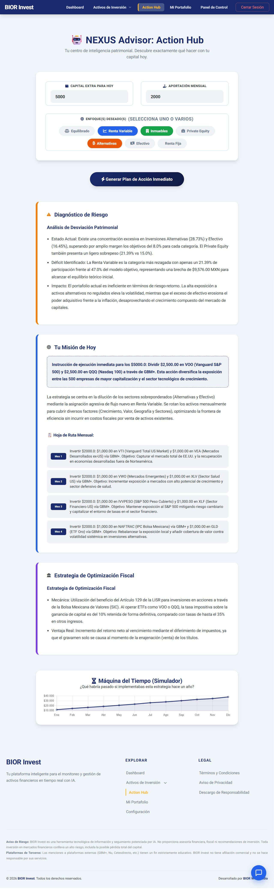
  
  <p style="color: #64748b; font-size: 0.85rem; font-style: italic; margin-top: 10px;">
     <b>Fig. 7:</b> El Action Hub generando una estrategia patrimonial completa, desde el diagnóstico hasta el simulador de futuro.
  </p>
</div>

---

### 4.2. Asistente Inteligente
Además del reporte completo, dentro de la página del portafolio pusimos un chat dinámico. Este asistente también tiene permiso para consultar tu distribución de activos en Django en tiempo real.
- **¿Qué hace?** Compara lo que tienes invertido contra tu perfil de riesgo de forma conversacional.
- **¿Cuál es el resultado?** Te escribe respuestas rápidas y consejos personalizados para resolver dudas puntuales sin salir de tu panel principal.

<div align="center">
  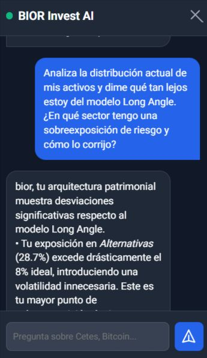

  <p style="color: #64748b; font-size: 0.85rem; font-style: italic; margin-top: 10px;">
     <b>Fig. 8:</b> Interacción en tiempo real mediante chat con NEXUS Core para consultas rápidas sobre el portafolio.
  </p>
</div>

---

### 4.3. El Ecosistema Omnicanal: NEXUS en WhatsApp y Telegram

Para lograr una fricción cero, integramos **NEXUS Core** con WhatsApp y **Telegram** mediante una orquestación avanzada en **n8n**, hosteado en nuestra infraestructura privada de **CubePath**. Este motor híbrido maneja dos vías de comunicación clave: **Consultas Reactivas** (Tú le hablas) y **Alertas Proactivas** (NEXUS te habla a ti).

<div align="center" style="margin: 30px 0;">
  <table style="border-collapse: collapse; border: 1px solid #30363d; border-radius: 12px; width: 100%; overflow: hidden;">
    <thead>
      <tr style="border-bottom: 1px solid #30363d;">
        <th style="padding: 15px; color: #58a6ff; font-size: 1.1rem;">
          ⚙️ Arquitectura del Flujo Multimodal
        </th>
      </tr>
    </thead>
    <tbody>
      <tr>
        <td style="padding: 25px; text-align: left; line-height: 1.6;">
          <h4 style="color: #26A5E4; margin-top: 0; margin-bottom: 10px;">Flujo 1: Consultas Reactivas (Voz y Texto)</h4>
          <b>1. Ingesta Inteligente:</b> Captura de eventos vía Webhook seguro. Un nodo <code>Switch</code> discrimina instantáneamente entre <i>Plain Text</i> y archivos binarios <code>.ogg</code>.<br><br>
          <b>2. Speech-to-Text (Whisper):</b> Descarga asíncrona de audios y procesamiento mediante el servidor de <b>Whisper AI</b> para una transcripción financiera de alta fidelidad.<br><br>
          <b>3. Contexto Dinámico (Django Bridge):</b> Petición <code>POST</code> autenticada hacia el backend de <b>Django</b>. El sistema procesa el número telefónico o ID de Telegram para realizar un cruce de datos exacto con el portafolio real del usuario.<br><br>
          <b>4. Cierre del Bucle:</b> Generación de respuesta estratégica vía IA y entrega al chat del usuario en &lt; 2 segundos.
          <hr style="border-top: 1px solid #30363d; margin: 25px 0;">
          <h4 style="color: #00df81; margin-top: 0; margin-bottom: 10px;">Flujo 2: Alertas Proactivas por Umbral</h4>
          <b>1. Monitoreo Constante:</b> Un disparador programado en n8n realiza peticiones periódicas hacia la API de notificaciones en Django (<code>/api/v1/nexus-alerts/</code>).<br><br>
          <b>2. Reglas de Negocio:</b> Django evalúa en tiempo real si el portafolio requiere rebalanceo o si un activo alcanzó un hito de rendimiento positivo.<br><br>
          <b>3. Push Notifications:</b> Si el nodo <code>IF</code> de n8n detecta una lista de datos válida, el sistema dispara alertas inmediatas a la cuenta de <b>Telegram</b> del usuario, incluyendo enlaces profundos al portafolio para la gestión de sus activos.
        </td>
      </tr>
    </tbody>
  </table>
</div>

## 📸 Evidencia de Ejecución

Debido a las políticas de seguridad de la API de **Twilio**, el acceso a WhatsApp está restringido al número del desarrollador para pruebas de integridad. Sin embargo, el **bot de Telegram** está operativo para enviar notificaciones proactivas de cuenta una vez el usuario ha vinculado su ID en la plataforma web.

<div align="center" style="margin-bottom: 40px;">
  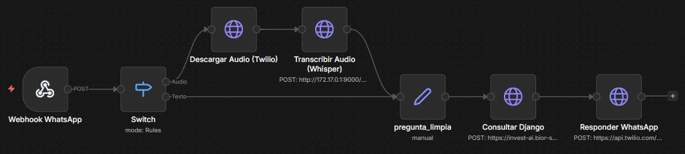
  <p style="color: #64748b; font-size: 0.85rem; font-style: italic; margin-top: 10px;">
    <b>Fig. 9:</b> Grafo de ejecución en n8n mostrando la bifurcación lógica, flujos híbridos y el éxito del proceso.
  </p>
</div>

<div align="center">
  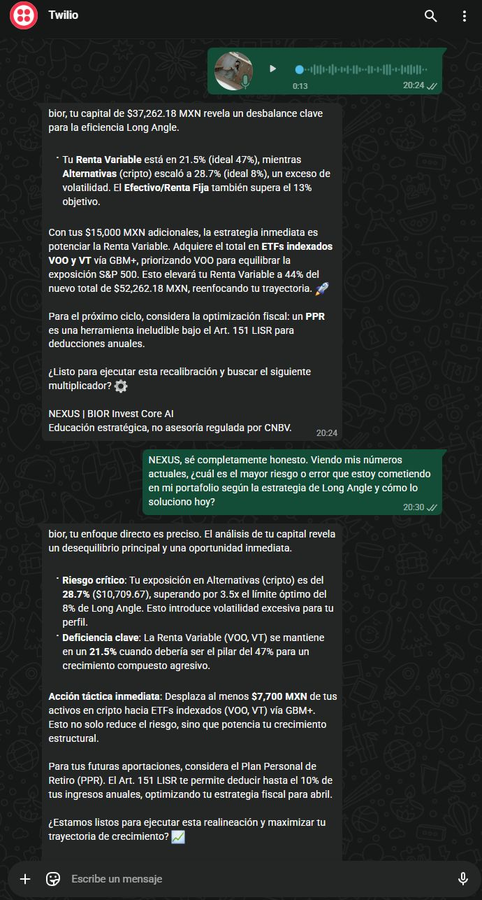
  <p style="color: #64748b; font-size: 0.85rem; font-style: italic; margin-top: 10px;">
    <b>Fig. 10:</b> Interfaz recibiendo asesoría patrimonial y alertas de NEXUS en tiempo real.
  </p>
</div>

A diferencia de WhatsApp, el **bot de Telegram (@BiorNexusBot)** opera de forma nativa e híbrida. Sirve tanto para responder consultas asíncronas de voz o texto, como para despachar las **Alertas Proactivas** generadas por el motor financiero en Django.

<div align="center" style="margin-bottom: 40px;">
  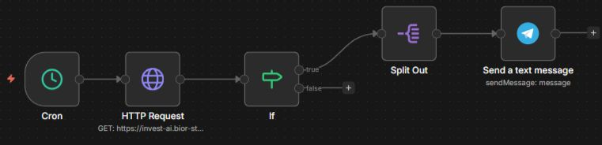
  <p style="color: #64748b; font-size: 0.85rem; font-style: italic; margin-top: 10px;">
     <b>Fig. 11:</b> Orquestación en n8n para el flujo de Telegram. Se aprecia el nodo 'Cron' disparando la consulta al 'Django Bridge' y la ejecución exitosa del nodo 'Telegram' al detectar un desbalance.
  </p>
</div>

<div align="center">
  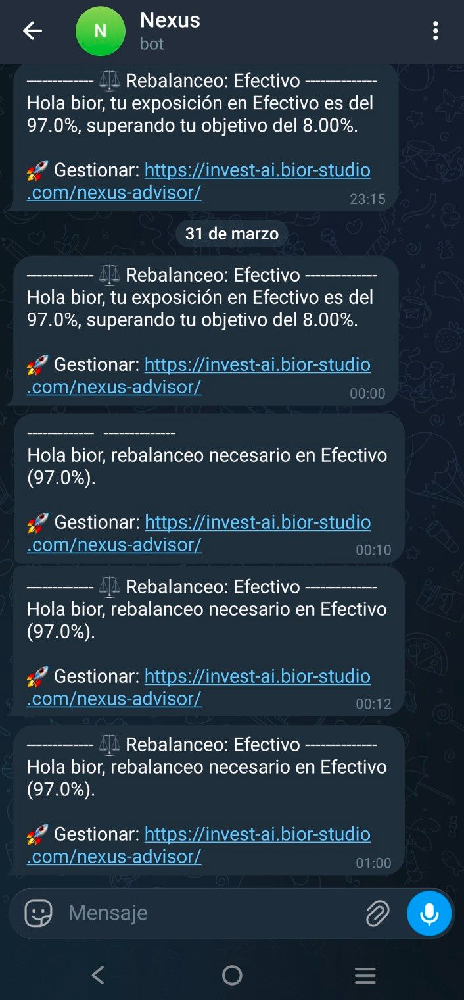
  <p style="color: #64748b; font-size: 0.85rem; font-style: italic; margin-top: 10px;">
    <b>Fig. 12:</b> Interfaz nativa de Telegram recibiendo una alerta automatizada de NEXUS al detectar un 97% de efectivo en el portafolio real del usuario.
  </p>
</div>

> **🔒 Nota de Seguridad:** La comunicación entre n8n y Django está protegida mediante una **X-Api-Key** de alta entropía (para envíos POST) y **Tokens de Validación** (para extracciones GET), asegurando que la información financiera y las alertas nunca viajen de forma expuesta.

## 5. 🎨 Experiencia del Usuario (UX / UI)

El diseño de la plataforma prioriza la reducción de la carga cognitiva y la legibilidad inmediata de datos financieros complejos.

- **Visualización de Datos:** Integración de `Chart.js` para renderizar gráficas de dona reactivas que reflejan instantáneamente la composición y los rebalanceos del portafolio.
- **Retroalimentación Visual:** Sistema de notificaciones no intrusivas en el cliente implementado con `SweetAlert2`, junto con validación de estado asíncrono para operaciones CRUD de activos.
- **Diseño Responsivo:** Tablas de datos fluidas con paginación algorítmica calculada en el cliente y adaptación estrictamente *mobile-first*.
- **UX Proactiva:** La experiencia del usuario evoluciona más allá del navegador. Al integrar alertas mediante Telegram, invertimos el flujo tradicional: el usuario no tiene que entrar diariamente al dashboard para buscar problemas; el sistema le notifica de forma proactiva con enlaces directos (*deep links*) para facilitar la toma de decisiones.

<div align="center">
  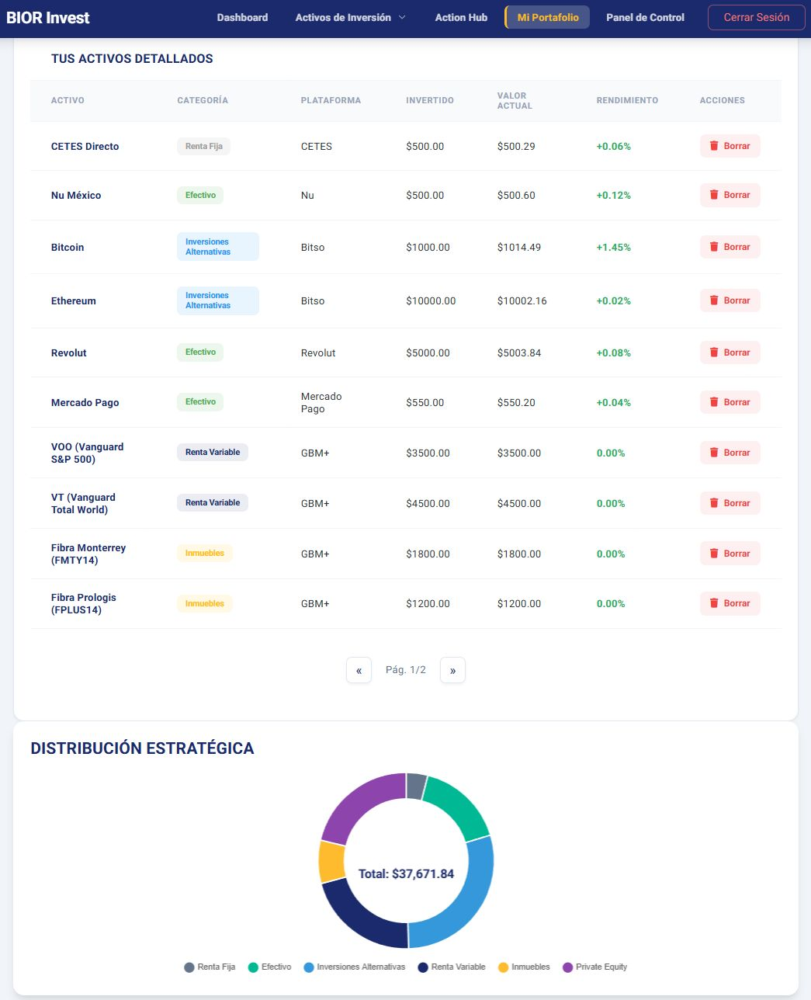
  
  <p style="color: #64748b; font-size: 0.85rem; font-style: italic; margin-top: 10px;">
    <b>Fig. 13:</b> Componente de visualización estratégica reflejando la distribución de activos.
  </p>
</div>

---

## 6. 📦 Guía de Despliegue (Reproducibilidad)

El proyecto está diseñado para ser desplegado de manera nativa y ligera en infraestructura Linux, operando exitosamente incluso en instancias con recursos limitados (1 vCPU, 2GB RAM en Ubuntu 24.04).

### Prerrequisitos
- Servidor Linux VPS (Recomendado: [CubePath](https://cubepath.com/))
- Python 3.10+ y `pip` instalados.
- Entorno virtual (`venv`) configurado.
- *(Opcional)* Instancia de n8n para orquestar los flujos de mensajería omnicanal.

### Pasos de Instalación Nativa

1. Clonar el repositorio:
   ```bash
   git clone [https://github.com/AlanBIOR/bior-invest-ai.git](https://github.com/AlanBIOR/bior-invest-ai.git)
   cd bior-invest-ai
   ```
   
2. Crear y activar el entorno virtual, e instalar dependencias:
   ```bash
   python3 -m venv venv
   source venv/bin/activate
   pip install -r requirements.txt
   ```

3. Configurar variables de entorno
   ```env
   SECRET_KEY=tu_django_secret
   DEBUG=False
   BANXICO_TOKEN=tu_token_banxico
   GEMINI_API_KEY=tu_token_gemini
   ```

4. Ejecutar migraciones y recolectar archivos estáticos:
   ```bash
   python manage.py migrate
   python manage.py collectstatic --noinput
   ```

5. Levantar el servicio en producción (Usando Gunicorn):
   ```bash
   gunicorn core.wsgi:application --bind 0.0.0.0:8000 --workers 3   
   ```

---

✨ **Un proyecto de [Alan Alfonso Rodríguez Ibarra](https://github.com/AlanBIOR)**

Desarrollar **BIOR Invest AI** para la **CubePath Hackathon 2026** fue una experiencia brutal. Me encantó el reto de exprimir al máximo un VPS para crear una herramienta que realmente ayude a las personas a mejorar sus finanzas y entender el poder de su dinero. ¡Gracias por ser parte de este camino y por revisar mi trabajo! 

### 📧 Email de contacto 
* ✉️ **Email:** [bior2610@gmail.com](mailto:bior2610@gmail.com)
* ✉️ **Email Personal:** [alanalfonso261002@gmail.com](mailto:alanalfonso261002@gmail.com)

### ✅ Confirmación de Participación

- [x] Mi proyecto está desplegado en CubePath y funciona correctamente.
- [x] El repositorio es público y contiene un README con la documentación.
- [x] He leído y acepto las [reglas de la hackatón](https://github.com/midudev/hackaton-cubepath-2026).